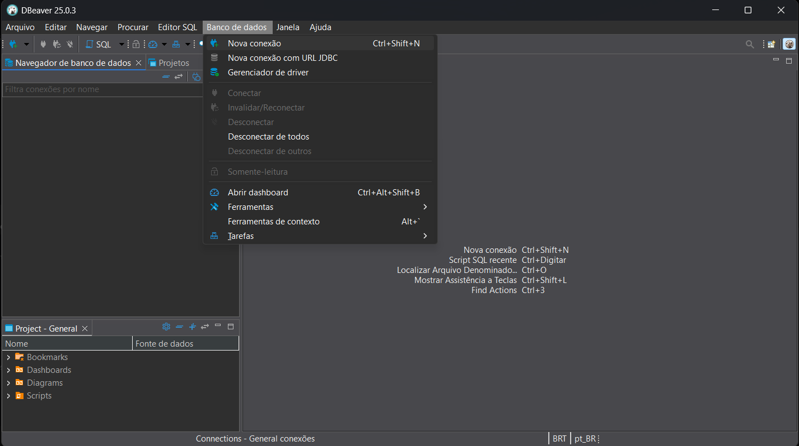
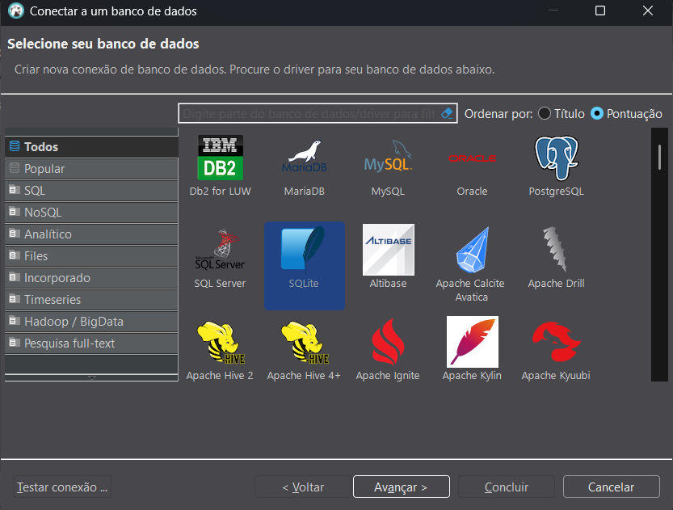
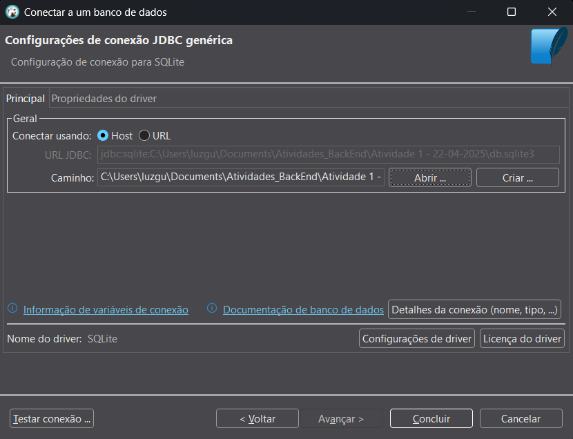
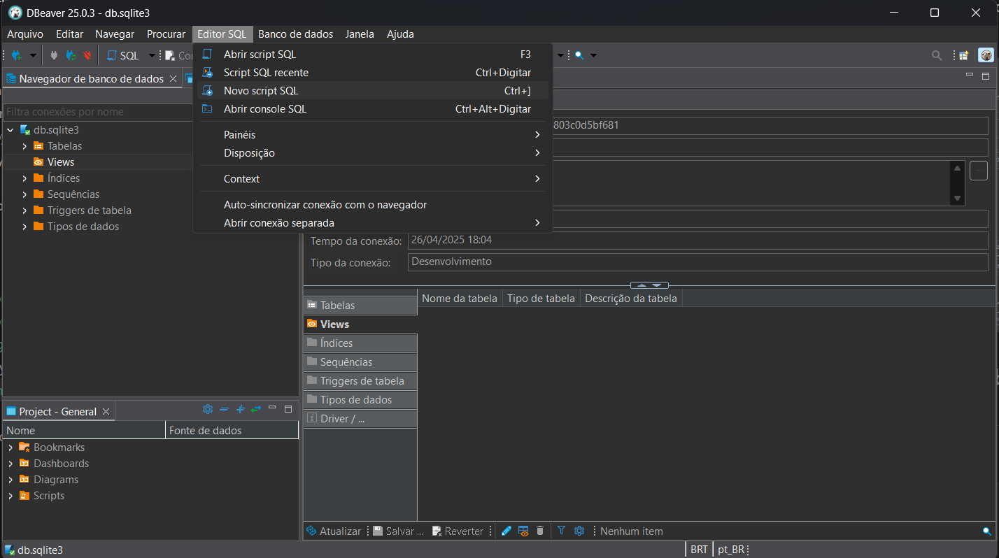
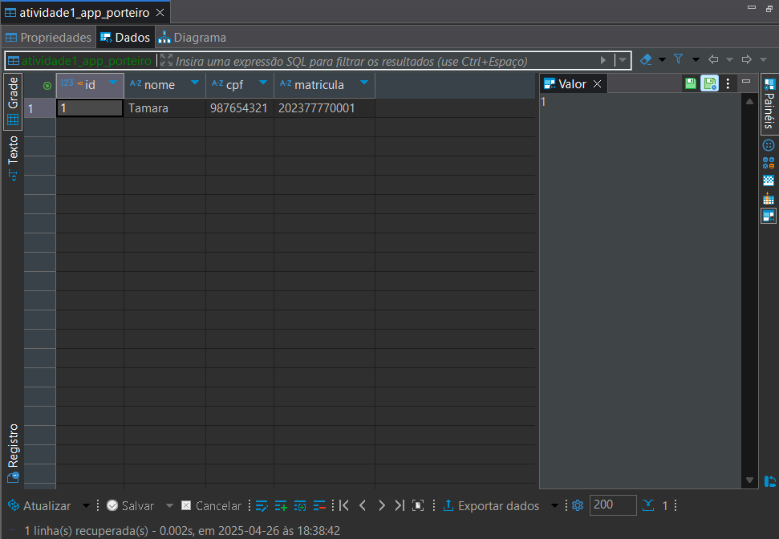
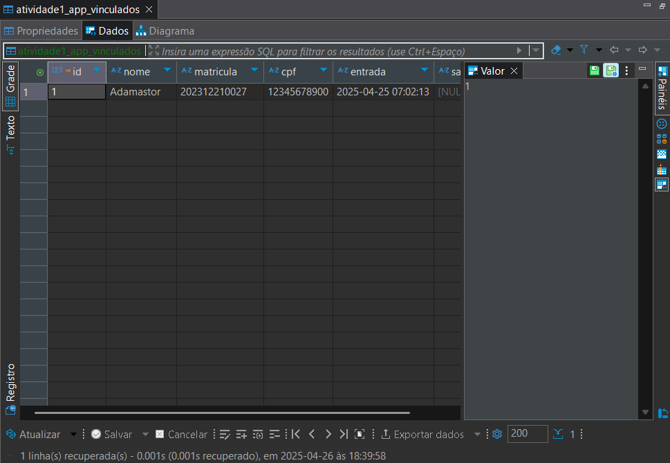
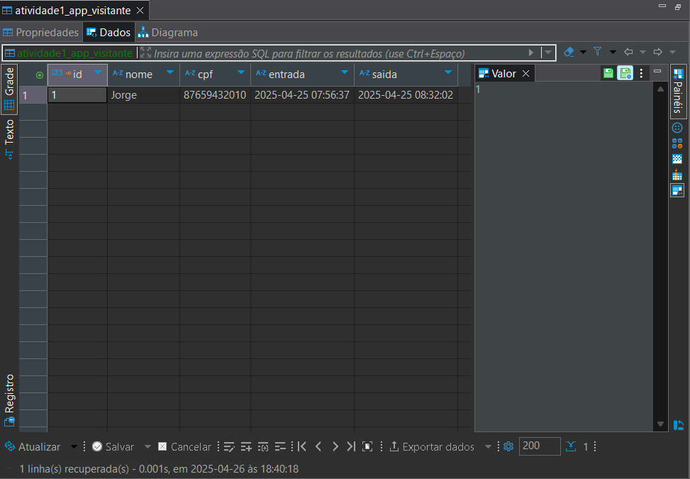

# Atividade 1 - 22-04-2025
## Instruções da Atividade
1. [Definir os modelos do arquivo models.py (pelo menos 3 tabelas).](#etapa-1---definindo-os-modelos-do-arquivo-modelspy)

2. [Realizar migrações com makemigrations e migrate.](#etapa-2---realizando-migrações-com-makemigrations-e-migrate)

3. [Testar os modelos no shell do Django.](#etapa-3---testando-os-modelos-no-shell-do-django)

4. [Configurar conexão com o SQLite no DBeaver.](#etapa-4---configurando-conexão-com-o-sqlite-no-dbeaver)

5. [Inserir dados fictícios nas tabelas usando comandos SQL.](#etapa-5---inserindo-dados-fictícios-nas-tabelas-usando-comandos-sql)

6. [Verificar a estrutura e os dados das tabelas no DBeaver.](#etapa-6---verificar-a-estrutura-e-os-dados-das-tabelas-no-dbeaver)
## Etapa 1 - Definindo os modelos do arquivo models.py
```python
from django.db import models

class Vinculados(models.Model):
    nome = models.CharField(max_length=100)
    matricula = models.CharField(max_length=12)
    cpf = models.CharField(max_length=11)
    entrada = models.DateTimeField(null=True, default = None)
    saida = models.DateTimeField(null=True, default = None)

class Visitante(models.Model):
    nome = models.CharField(max_length=100)
    cpf = models.CharField(max_length=11)
    entrada = models.DateTimeField(null=True, default = None)
    saida = models.DateTimeField(null=True, default = None)

class Porteiro(models.Model):
    nome = models.CharField(max_length=100)
    cpf = models.CharField(max_length=11)
    matricula = models.CharField(max_length=12)
```
## Etapa 2 - Realizando migrações com makemigrations e migrate
```shell
python manage.py makemigrations

python manage.py migrate
```
## Etapa 3 - Testando os modelos no shell do Django
```shell
#Entrando no Shell
python manage.py shell

#Importando o modelo
from atividade1_app.models import Vinculados

#Criando uma instância em Vinculados
novo_Vinculado = Vinculados(nome="Adamastor", matricula="202312210027", cpf="12345678900")

#Salvando a alteração
novo_Vinculado.save()

#Mostrar a informação salva
Vinculados.objects.all()
```
## Etapa 4 - Configurando conexão com o SQLite no DBeaver
Com o DBeaver aberto, selecionar a opção [Banco de Dados]() e [Nova conexão]()



Seleciona-se então a opção do SQLite e [Avançar]()



Colocar o caminho para o banco de dados do projeto e apertar em [Concluir]()


## Etapa 5 - Inserindo dados fictícios nas tabelas usando comandos SQL
Criando um novo script


```SQL
INSERT INTO atividade1_app_porteiro (nome, cpf, matricula) VALUES ('Tamara', '98765432100', '202377770001');

INSERT INTO atividade1_app_visitante (nome, cpf, entrada, saida) VALUES ('Jorge', '87659432010', '2025-04-25 07:56:37', '2025-04-25 08:32:02');

UPDATE atividade1_app_vinculados
SET entrada = '2025-04-25 07:02:13'
WHERE nome = 'Adamastor';
```
## Etapa 6 - Verificar a estrutura e os dados das tabelas no DBeaver
Tabela [Porteiro]()



Tabela [Vinculados]()



Tabela [Visitante]()

