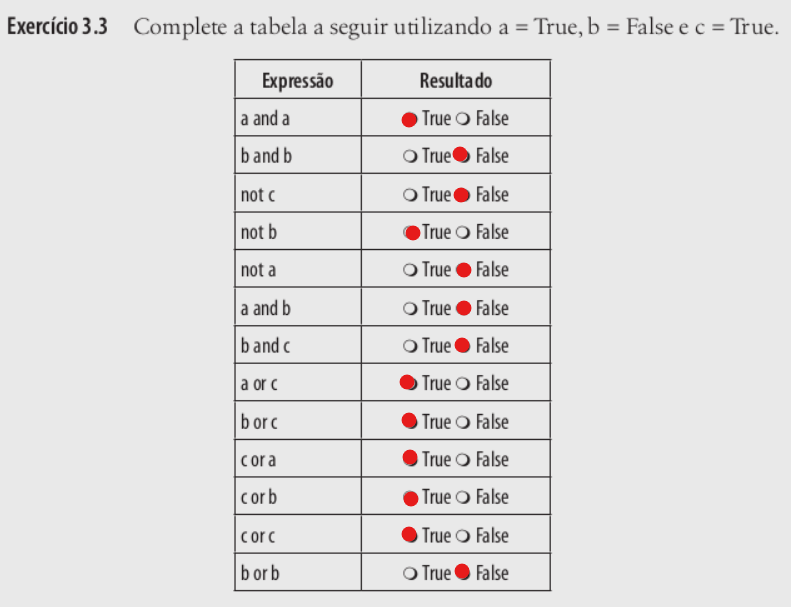

# Atividade 3
## Questões
1. [Questão 3.1](#questão-31)

2. [Questão 3.2](#questão-32)

3. [Questão 3.3](#questão-33)

4. [Questão 3.5](#questão-35)

5. [Questão 3.6](#questão-36)

6. [Questão 3.7](#questão-37)

7. [Questão 3.8](#questão-38)

8. [Questão 3.9](#questão-39)

9. [Questão 3.10](#questão-310)

10. [Questão 3.11](#questão-311)
## Questão 3.1

## Questão 3.2

## Questão 3.3

## Questão 3.5

## Questão 3.6
```python
matéria1 > 7 and materéria2 > 7 and matéria3 > 7
```
## Questão 3.7
```python
n1 = int(input("Digite um número inteiro: "))
n2 = int(input("Digite outro número inteiro: "))

print("\nA soma deles é:", n1+n2)
```
[| Arquivo da questão |](q3_7.py)
## Questão 3.8
```python
metros = float(input("Digite o valor em metros: "))

print("\nEm milímetros é equivalente a:", metros*1000, "mm")
```
[| Arquivo da questão |](q3_8.py)
## Questão 3.9
```python
diasParaSegundos = int(input("Digite a quantidade de Dias: ")) * 86400
horasParaSegundos = int(input("\nDigite a quantidade de Horas: ")) * 3600
minutosParaSegundos = int(input("\nDigite a quantidade de Minutos: ")) * 60
segundos = int(input("\nDigite a quantidade de Segundos: "))

segundosTotais = diasParaSegundos + horasParaSegundos + minutosParaSegundos + segundos

print("\nO total de segundos é:", segundosTotais)
```
[| Arquivo da questão |](q3_9.py)
## Questão 3.10
```python
salario = float(input("Informe o valor do salário: "))
porcentagemAumento = float(input("\nInforme o aumento (sem o símbolo %): "))

valorAumento = round(salario * porcentagemAumento / 100, 2)
novoSalario = salario + valorAumento

print("\nAumento: R$"f"{valorAumento:.2f}")
print("Novo salário: R$"f"{novoSalario:.2f}")
```
[| Arquivo da questão |](q3_10.py)
## Questão 3.11
```python
valorProduto = float(input("Informe o valor do produto: "))
porcentagemDesconto = float(input("\nInforme o desconto (sem o símbolo %): "))

valorDesconto = round(valorProduto * porcentagemDesconto / 100, 2)
valorAPagar = valorProduto - valorDesconto

print("\nDesconto: R$"f"{valorDesconto:.2f}")
print("Valor a pagar: R$"f"{valorAPagar:.2f}")
```
[| Arquivo da questão |](q3_11.py)